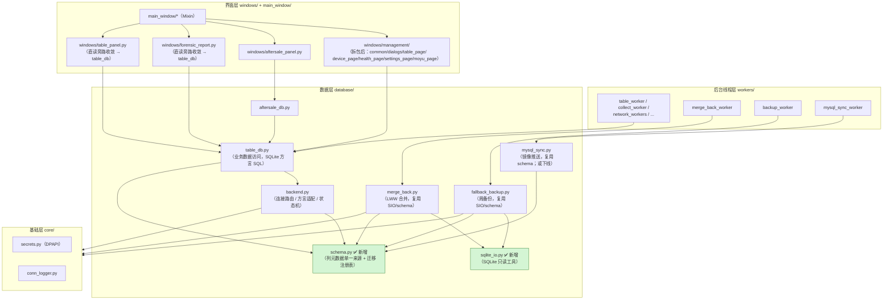
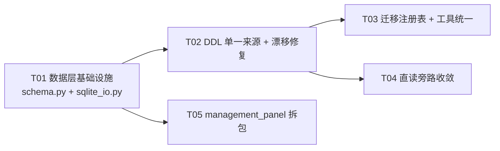

# AutoWork 架构评审与 SQL 代码优化方案

> 评审人：架构师（Bob）
> 评审日期：2026-08-22
> 评审范围：AutoWork（PySide6 + Fluent-Widgets 桌面应用），重点：代码拆分/合并需求、SQL 代码专项
> 依据：真实源码静态分析（文件路径/行数/函数名为证），测试基线：`tests/` 全量 **84 passed**（`pytest.ini` + venv 实测）
> 约束：本次仅调研+出方案，**未修改任何源码**，未运行任何改动数据库的命令

---

## 0. 结论速览（TL;DR）

1. **SQL 代码存在"三份 DDL、三处迁移、两份 SQLite 读取工具、两份售后业务键"的重复**，且已发生真实漂移（`mysql_sync._DDL_XQZG_STATUS` 缺 `file_path` 列、`mysql_sync._ensure_schema` 缺 `is_initiative/is_our_problem/updated_at` 补列）。这是本次评审**最高优先级**问题。
2. **backend.py 与 table_db.py 不应合并**：职责不同（连接路由/方言适配 vs 业务数据访问），方向正确（table_db → backend）；正确做法是**共享 DDL/迁移/常量**，而非合并文件。
3. **两处 UI 层裸 `sqlite3` 直读旁路**（`windows/table_panel.py:512`、`windows/forensic_report.py:99`）绕过双后端路由，MySQL 主模式下读到的是陈旧 SQLite 基线（≤7 天周备份新鲜度），应收敛到 `table_db` 双后端 API。
4. **最大文件 `windows/management_panel.py`（4483 行）**职责混杂六页，建议拆为 `windows/management/` 包（P2）。
5. 给出 **5 个有序任务**（硬性上限），全部以"保持 84 测试全绿 + 新增一致性测试"为验收门槛。

---

## 1. 现状盘点表（模块 / 文件 / 行数 / 职责 / 问题）

### 1.1 数据层 database/（本次 SQL 专项核心）

| 文件 | 行数 | 职责 | 问题 |
|---|---|---|---|
| `database/table_db.py` | 1949 | SQLite 建表 DDL（7 表）、`_ensure_initialized` 迁移、FTS5 全文索引、billiard/xqzg/kd/health/submission/mapping 全部 CRUD、`_get_conn` 双后端路由 | ① 体积大且职责混杂（DDL+迁移+FTS+7 表 CRUD 一文件）；② DDL 与 backend/mysql_sync 三处重复；③ 迁移块 8 处散落 `_ensure_initialized`（L347-456） |
| `database/backend.py` | 575 | MySQL 开关/配置缓存（L28）、SQLite→MySQL 方言转换（L91-238）、连接适配器（L137-345）、`create_mysql_connection`（L350）、`MYSQL_DDL`（L382-525，7 表）、后端状态机 STATE_ONLINE/DEGRADED（L528-575） | ① 自身职责 4 合 1（配置+方言+连接+DDL+状态机）可拆；② `MYSQL_DDL` 与 `mysql_sync._DDL_*` 近乎整份重复；③ 方言转换是"按需修补"式：`convert_on_conflict` 只认 `device_mapping` 一种形态（L111-127），`_convert_sqlite_date_functions` 只认 `query_kd_alerts` 一种形态（L198-216） |
| `database/mysql_sync.py` | 629 | SQLite→MySQL 单向镜像推送（机制 B）：自己的 `_DDL_*`（L61-202，第三份 DDL）、`_ensure_schema`（L233）、`_read_sqlite`（L278）、`push_all/push_table/push_aftersale`（L437-608）、`_AFTERSALE_KEY_COLS`（L548） | ① DDL 第三份且已漂移（`_DDL_XQZG_STATUS` 缺 `file_path`，L76-93；`_ensure_schema` 只补 `city`/`occurred_at`，L254-271，缺 `is_initiative/is_our_problem/updated_at/file_path`）；② 主模式下 P0 守卫 no-op，代码实际"僵尸"但保留着；③ `_read_sqlite` 与 merge_back 重复 |
| `database/merge_back.py` | 232 | 恢复后 LWW 合并（阶段二）：`merge_aftersale`（L77）、`merge_device_mapping`（L124）、`merge_ops_tables`（L158）、`merge_back`（L207） | ① `_read_sqlite_rows`（L46）与 `mysql_sync._read_sqlite`（L278）逻辑几乎相同；② `_AFTERSALE_KEY`（L29）与 `mysql_sync._AFTERSALE_KEY_COLS`（L548）重复定义 |
| `database/fallback_backup.py` | 144 | MySQL→SQLite 周备份（兜底基线刷新）：`backup_mysql_to_sqlite`（L74）、`maybe_backup`（L137）、`set_last_backup_time`（L49） | `set_last_backup_time`（L55）裸 `INSERT OR REPLACE INTO sync_meta`（直连 SQLite，当前安全，但与统一写入约定不一致） |
| `database/aftersale_db.py` | 711 | 售后记录 CRUD + 周期计算 + Excel 导入导出，全部经 `table_db.get_conn()` 双后端路由（L211-213） | 相对健康；`RECORD_FIELDS`（L42）是售后业务键/字段的语义源头，但 `_AFTERSALE_KEY_COLS` 未收敛到此处 |
| `database/mysql_sync_card_logic.py` | 34 | 纯函数入口判定（可单测） | 健康 |
| `database/__init__.py` | 0 | 空 | — |

### 1.2 workers/（后台线程层）

| 文件 | 行数 | 职责 | 问题 |
|---|---|---|---|
| `workers/table_worker.py` | 598 | 三个 API Worker（wechat2-billiard / xqzg / kd）+ 图片迁移 + 登录测试 | 无 SQL（纯网络），健康；`clip_base_name` 与 `table_db._clip_base`（L1408）重复但已注释说明刻意独立 |
| `workers/network_workers.py` | 592 | TCP/SFTP/SSH Worker | 无 SQL，健康 |
| `workers/collect_worker.py` | 442 | 文件收集/打包上传 + `resolve_device_dir`（L84，调 table_db） | 无裸 SQL，健康 |
| `workers/merge_back_worker.py` | 65 | `MergeBackWorker(QThread)` 异步合并 | 健康 |
| `workers/mysql_sync_worker.py` | 65 | `MysqlSyncWorker`/`MysqlTestWorker` | 健康 |
| `workers/backup_worker.py` | 27 | `BackupWorker` 异步周备份 | 健康 |
| `workers/aftersale_worker.py` | 44 | `AftersaleDBWorker` 通用 DB 封装 | 健康 |

### 1.3 windows/（独立窗口层）

| 文件 | 行数 | 职责 | 问题 |
|---|---|---|---|
| `windows/management_panel.py` | **4483** | 运维面板六页：球桌管理（TablePage L1067）/设备状态（UploadListDialog L704 等）/健康度（L4200 段）/管理设置/小游戏；含 `_DBQueryWorker`（L385）、`_SortableTableWidget`（L419）、大量 QSS/调色板（L196-217） | **全项目最大文件**，职责混杂（6 页 + 5 个对话框 + 工具函数）；数据访问已规范走 table_db（见 1.4 结论），但文件组织急需拆分 |
| `windows/sftp_window.py` | 1933 | SFTP 双面板文件管理 + 传输队列 | 体积大（P2 可选拆），无 SQL |
| `windows/aftersale_panel.py` | 1533 | 售后面板（录入/统计/设置） | 体积大（P2 可选拆），无裸 SQL（全部走 aftersale_db） |
| `windows/moyu_widgets.py` | 1481 | 摸鱼阅读器/小游戏 | 体积大（P2 可选拆），无 SQL |
| `windows/table_panel.py` | 586 | 球桌面板（**旧版**，README L123 注明"仅 AddRecordDialog 仍被引用"，L88） | **裸 SQL 旁路**：`_check_device_offline`（L497）在 L512 直接 `sqlite3.connect(table_db.DB_PATH)` 查 kd_status——绕过双后端，主模式下读陈旧 SQLite |
| `windows/forensic_report.py` | 538 | SSH 故障取证报告 + AI 分析 | **裸 SQL 旁路**：`_open_readonly_db`（L99）直接只读连 tables.db，`lookup_table_info`（L112）/`lookup_kd_status`（L148）直查——主模式下读陈旧 SQLite（只读，无破坏性，但语义错误） |
| `windows/conn_diag_panel.py` | 634 | 连接诊断面板 | 无 SQL，健康 |
| `windows/table_panel.py` 其余 / ssh_terminal / ansi_terminal / rdp / image_viewer / port_fake / single_video / tunnel | — | 各自窗口 | 无 SQL |
| `windows/mysql_sync_card.py` | 251 | MySQL 配置卡片（表单+测试+保存+历史同步） | 健康；依赖机制 B 的"立即同步"已随 P0 守卫降为 no-op，UI 文案需后续澄清（见待明确事项） |

### 1.4 main_window / main / 其余

| 文件 | 行数 | 职责 | 问题 |
|---|---|---|---|
| `main_window/ui_mixin.py` | 1843 | 状态栏/菜单栏/工具菜单/右键菜单/主题 | 体积大（P2 可选拆）；SQL 访问仅 1 处（L1131 调 table_db.insert_one），规范 |
| `main_window/main_window.py` | 1506 | MainWindow 主类 | 体积大但已是 Mixin 组合，可接受 |
| `main_window/remote_mixin.py` | 1142 | 远程连接（frpc/SSH/SFTP/RDP） | 调 table_db.query_page/get_table_name_by_snk（L448/L764），规范 |
| `main_window/settings_dialog.py` / `process_mixin.py` / `settings_mixin.py` | 716/550/209 | 设置/进程 | 无 SQL |
| `main.py` | 123 | 入口 | 健康 |
| `core/`（frp_remote 743 / secrets 259 / 其余） | — | 基础层 | 无 SQL；`core/secrets.py` DPAPI 加密确认存在（L82-86 被 backend/mysql_sync 引用） |
| `win_api/windows_api.py` | 415 | ctypes | 无 SQL |

### 1.5 结论：SQL 触达点全图

| 含 SQL 的文件 | DDL | DML | 迁移 | 镜像/合并 |
|---|---|---|---|---|
| `database/table_db.py` | SQLite 7 表 | billiard/xqzg/kd/health/submission/mapping 全量 CRUD | `_ensure_initialized` 8 块 ALTER/DROP | — |
| `database/backend.py` | MySQL 7 表（MYSQL_DDL） | — | `_ensure_mysql_tables`（L583-646）4 块补列 | 状态机触发合并 hook |
| `database/mysql_sync.py` | MySQL 7 表（第三份） | push replace/upsert/insert_ignore | `_ensure_schema`（L233-273）2 块补列 | push_all/push_table/push_aftersale（主模式 P0 守卫 no-op） |
| `database/merge_back.py` | — | LWW upsert | — | merge_aftersale/device_mapping/ops_tables |
| `database/fallback_backup.py` | sync_meta 兜底建表 | DELETE + INSERT OR REPLACE | — | backup_mysql_to_sqlite |
| `database/aftersale_db.py` | — | aftersale CRUD（经路由） | — | — |
| `windows/forensic_report.py` | — | SELECT（**直连只读 SQLite**） | — | — |
| `windows/table_panel.py` | — | SELECT（**直连 SQLite**） | — | — |
| `workers/*`、`windows/management_panel.py`、`main_window/*` | — | 全部经 table_db/aftersale_db，**无裸 SQL** ✅ | — | — |

---

## 2. SQL 专项评估

### 2.1 schema 定义是否单一来源？—— ❌ 否，三份且已漂移

同一 7 张表（billiard_tables / sync_meta / xqzg_status / kd_status / submission_log / device_mapping / health_alerts / aftersale_records）的建表定义存在 **3 份**：

| 来源 | 位置 | 方言 | 漂移证据 |
|---|---|---|---|
| `table_db.py` | `_CREATE_SQL` L52 / `_CREATE_STATUS_SQL` L206 / `_CREATE_SUBMISSION_SQL` L270 / `_CREATE_MAPPING_SQL` L290 / `_CREATE_HEALTH_ALERT_SQL` L916 / `_CREATE_AFTERSALE_SQL` L302 | SQLite | 基线 |
| `backend.py` | `MYSQL_DDL` L382-525 | MySQL | 含 `file_path`、`is_initiative/is_our_problem/occurred_at/updated_at`（最新） |
| `mysql_sync.py` | `_DDL_*` L61-202 | MySQL | **`_DDL_XQZG_STATUS`（L76-93）缺 `file_path` 列**（backend/table_db 均有）——若镜像模式首次建库，xqzg 表结构落后，后续推送缺列 |

**风险**：新增列/改列时需同时改 3 处；任何一处遗漏即产生"同一表两端结构不一致"的运行期故障（如 `_probe_status_ext_cols` 专门为探测缺列而写，table_db.py L1121——本质是给 DDL 漂移打的补丁）。

### 2.2 迁移逻辑是否分散？—— ❌ 否，三处且覆盖面不一致

| 位置 | 覆盖表 | 补列清单 |
|---|---|---|
| `table_db._ensure_initialized`（L347-456） | SQLite：aftersale/billiard/kd/xqzg/FTS | is_initiative/is_our_problem/occurred_at/updated_at、snk_code/code/city、KD_EXTRA_FIELDS、file_path |
| `table_db._ensure_mysql_tables`（L583-646） | MySQL：billiard/aftersale/xqzg/kd | city、is_initiative/is_our_problem/occurred_at/updated_at、KD_EXTRA_FIELDS、xqzg file_path |
| `mysql_sync._ensure_schema`（L233-273） | MySQL：billiard/aftersale | **仅 city + occurred_at**——缺 is_initiative/is_our_problem/updated_at/xqzg file_path |

**风险**：`mysql_sync._ensure_schema` 对存量 MySQL 库补列不全 → `push_aftersale` 读 `aftersale_db.RECORD_FIELDS`（含新列）INSERT 到缺列表时报 `no such column`；且主模式下该路径已被守卫拦截，"僵尸代码"的迁移缺陷不会立即暴露，一旦回退镜像模式即触发。

### 2.3 方言差异处理是否清晰？—— ✅ 基本清晰，但耦合隐式

- 优点：`backend._convert_sql()`（L187）集中处理占位符 / INSERT OR REPLACE / ON CONFLICT / date() / COLLATE NOCASE / 保留字；`MysqlCursorAdapter`/`MysqlConnectionAdapter` 模拟 sqlite3 接口，调用方（table_db/aftersale_db）**无感知**写 SQLite 方言。
- 隐患：转换器是"按需修补"式——`convert_on_conflict` 只匹配 `device_mapping` 的 `ON CONFLICT(device_code)` 形态（L111-127），`_convert_sqlite_date_functions` 只匹配 `query_kd_alerts` 的 `replace(date(...'-N days'))` 形态（L198-216）。**新增任何 SQLite 专有写法都必须同步扩展转换器**，且无文档列出"已支持清单"。schema.py 落地时应补文档。
- 结论：**backend.py 与 table_db.py 不应合并**。理由：① 职责不同——backend 是"连接路由/方言适配/状态机"基础设施，table_db 是"业务数据访问"；依赖方向 table_db → backend 正确；② 合并将形成 ~2500 行单文件，且把连接层与业务层耦合；③ 重复的根因是 **DDL/迁移/常量未共享**，而非文件未合并。正确动作：抽 `schema.py` 共享结构元数据与迁移注册表，两文件各自保留职责。

### 2.4 sync_meta 写入约定核查

| 位置 | 写法 | 是否合规 |
|---|---|---|
| `table_db._upsert_sync_meta`（L665） | 先 INSERT 失败回退 UPDATE | ✅ 约定的唯一入口；save_all L746 / save_xqzg L1167 / save_kd L1225 / upsert_kd L1279 / _save_status_table L1886 均已走它 |
| `table_db._setup_fts` L167 | 裸 `INSERT OR REPLACE INTO sync_meta`（`fts_built`） | ⚠️ 仅 SQLite 路径（MySQL 模式直接 return，L133-137），当前安全；但字面上违反约定，建议改走 `_upsert_sync_meta` |
| `mysql_sync.push_all` L488-491 | `INSERT INTO sync_meta ... ON DUPLICATE KEY UPDATE` | ⚠️ MySQL-safe（非 1062 路径），但属第二写入路径；若迁移到公共层应统一 |
| `fallback_backup.set_last_backup_time` L55 | 裸 `INSERT OR REPLACE INTO sync_meta`（直连 SQLite） | ⚠️ 直连 SQLite 安全；建议统一走工具函数 |

### 2.5 直读旁路（MySQL 主模式下读陈旧 SQLite）

- `windows/table_panel.py:512`：`sqlite3.connect(table_db.DB_PATH, timeout=3)` 查 kd_status——已有等价双后端 API `table_db.get_latest_kd_status(table_id)`（L1574，返回 `{"status","file_path"}`），**可直接替换**（第二段 device_code LIKE 降级查询需保留或抽新 API）。
- `windows/forensic_report.py:99-177`：`_open_readonly_db()` 直连只读——`lookup_kd_status` 可改用 `table_db.get_latest_kd_status`；`lookup_table_info` 的 snk 精确/remark LIKE 兜底无现成 API，需在 table_db 新增只读函数或保留直读但注明"读的是兜底基线"。

---

## 3. 拆分建议清单（文件 → 建议动作 / 理由 / 风险）

| # | 文件（行数） | 建议动作 | 理由 | 风险与缓解 |
|---|---|---|---|---|
| S1 | `windows/management_panel.py`（4483） | 拆为 `windows/management/` 包：`common.py`（_DBQueryWorker/_SortableTableWidget/_ReadOnlySelectDelegate/QSS 工具）、`dialogs.py`（5 个对话框）、`table_page.py`、`device_page.py`（设备状态+上传+迁移）、`health_page.py`、`settings_page.py`、`moyu_page.py`；`windows/management_panel.py` 保留 re-export shim | 全项目最大文件，6 页+5 对话框+工具函数混杂；单文件超 4400 行无法并行开发 | 高改动面风险：先纯搬移不改逻辑；每页独立测试；shim 保兼容；集成回归 |
| S2 | `database/table_db.py`（1949） | 先抽 `database/schema.py`（DDL+迁移元数据）与 `database/sqlite_io.py`（只读工具）减负；**业务 CRUD 拆包列为后续可选**（见 T05 备注） | DDL+FTS+7 表 CRUD 一文件，SQL 专项核心 | 拆包会改 import 面（大量 `table_db.xxx` 调用点）；一期只抽公共层，不动 CRUD 组织 |
| S3 | `database/backend.py`（575） | 抽 `database/sql_dialect.py`（纯转换函数 convert_*），backend 保留路由/适配器/状态机 | 方言转换是纯函数，与连接/状态机无关，且最需要单测覆盖 | 低风险；保持 `backend.convert_*` 兼容别名避免破坏测试（tests/test_backend_sql_convert.py） |
| S4 | `database/mysql_sync.py`（629） | DDL/迁移并入 schema.py；推送逻辑保留（或整体下线，见待明确事项） | 第三份 DDL + 僵尸推送路径 | 若整体下线需确认"多端镜像"场景不再需要；保守做法先只去重 |
| S5 | `windows/sftp_window.py`（1933）/ `main_window/ui_mixin.py`（1843）/ `windows/aftersale_panel.py`（1533）/ `windows/moyu_widgets.py`（1481） | P2 可选拆分 | 体积大但与 SQL 无关 | 非本次重点，列入 backlog |

---

## 4. 合并建议清单（文件 → 建议动作 / 理由 / 风险）

### 4.1 SQL 专项合并（优先级最高）

| # | 重复点 | 现状证据 | 建议动作 | 风险与缓解 |
|---|---|---|---|---|
| M1 | **DDL 三份合一** | `table_db._CREATE_*`（SQLite）、`backend.MYSQL_DDL`（MySQL）、`mysql_sync._DDL_*`（MySQL） | 新建 `database/schema.py`：每表定义列元数据 `{col: (sqlite_type, mysql_type, default, index)}`，由 `schema.to_sqlite_ddl(table)` / `schema.to_mysql_ddl(table)` 生成双方言 DDL；三处改为引用 | 高价值中风险：必须保证生成 DDL 与现状**逐字节语义等价**（尤其 SQLite TEXT/INTEGER vs MySQL VARCHAR/LONGTEXT/INT、AUTO_INCREMENT vs rowid、索引/引擎/字符集）；用"DDL 一致性测试"（断言生成结果 == 现有常量）兜底 |
| M2 | **迁移三处合一** | `table_db._ensure_initialized`、`table_db._ensure_mysql_tables`、`mysql_sync._ensure_schema` | schema.py 内建"迁移注册表" `MIGRATIONS: {table: [(col, sqlite_alter, mysql_alter), ...]}`，SQLite/MySQL 各跑自己的清单；**顺带修复 mysql_sync 漏补列** | 中风险：SQLite 与 MySQL 的 ALTER 语法/默认值规则不同（如 MySQL 文件列不能带 DEFAULT）；按表按列独立注册，测试覆盖"旧库补列" |
| M3 | **SQLite 读取工具重复** | `mysql_sync._read_sqlite`（L278）与 `merge_back._read_sqlite_rows`（L46）几乎相同（PRAGMA 取列交集 + 缺列补空） | 抽 `database/sqlite_io.py::read_sqlite_table(table, columns)`，两处引用 | 低风险；保持现有"列交集防御"语义 |
| M4 | **售后业务键重复** | `mysql_sync._AFTERSALE_KEY_COLS`（L548）与 `merge_back._AFTERSALE_KEY`（L29）同值 `(created_at, creator, table_no, problem)` | 收敛到 `aftersale_db.py`（已有 `RECORD_FIELDS` L42）新增 `RECORD_KEY_COLS` 常量，两处引用 | 低风险 |
| M5 | **业务键 upsert 逻辑** | `mysql_sync.push_aftersale`（L551）与 `merge_back.merge_aftersale`（L77）共享"SELECT 判存在 → INSERT/UPDATE"骨架 | 抽公共"按业务键 upsert"helper；**注意二者语义不同**（push=本地最新覆盖远程，merge=LWW 按 updated_at），helper 只共享 SQL 构造与键定义，判定分支各自保留 | 中风险：语义差异不能强行合并；只合并骨架 |
| M6 | **直读旁路收敛** | `windows/table_panel.py:512`、`windows/forensic_report.py:99` | 改走 `table_db` 双后端 API（`get_latest_kd_status` 等）；forensic 缺 API 则新增只读函数 | 低风险：主模式下行为从"读陈旧基线"变为"读 MySQL"，语义修正 |

### 4.2 非 SQL 合并

| # | 重复点 | 现状证据 | 建议动作 | 风险与缓解 |
|---|---|---|---|---|
| M7 | 命名/解析工具重复 | `collect_worker.clip_base_name`（L21）与 `table_db._clip_base`（L1408）同规则 | 抽到 `core/utils.py` 或保留并注明（现有注释已说明"避免反向依赖"，可接受） | 低 |
| M8 | `_trigger_auto_mysql_sync` 双保险 | `management_panel.py:282` 与 `mysql_sync.push_*` 内 P0 守卫 | 保留双保险（防御纵深），仅统一注释 | 低 |

---

## 5. 目标架构图（Mermaid）

**单向依赖约定保持**：`core ← win_api ← workers ← windows ← main_window ← main.py`；`database` 与 windows/workers 同级（database 不反向依赖 windows/workers；仅 `table_db._trigger_merge_back` 在运行期延迟 import worker，属例外、有注释说明）。

---

## 6. 有序任务列表（实现顺序 / 依赖 / 改动文件 / 验收标准）

> 硬性约束：≤5 个任务；首个任务为基础设施；每任务 ≥3 个相关文件；尽量少线性依赖链。

### T01 — 数据层基础设施：schema.py + sqlite_io.py（P0）

- **改动文件**：`database/schema.py`（新建）、`database/sqlite_io.py`（新建）、`tests/test_schema_meta.py`（新建）、`tests/test_sqlite_io.py`（新建）
- **依赖**：无
- **内容**：
  1. `schema.py`：7 张表的列元数据 `{col: (sqlite_type, mysql_type, default, index)}` + `to_sqlite_ddl(table)` / `to_mysql_ddl(table)` 生成双方言 DDL + `MIGRATIONS` 迁移注册表占位；
  2. `sqlite_io.py`：`read_sqlite_table(table, columns)`（PRAGMA 列交集 + 缺列补空，语义对齐 `mysql_sync._read_sqlite`）；
  3. 测试：DDL 生成结果与现有 `table_db._CREATE_*` / `backend.MYSQL_DDL` 逐表对比一致；read_sqlite_table 与旧实现等价。
- **验收标准**：`pytest tests/ -q` 全绿（84 passed + 新增用例）；schema 生成 DDL 与现状一致（断言通过）；**不触碰任何现有业务代码**。

### T02 — DDL 单一来源落地 + 漂移修复（P0）

- **改动文件**：`database/table_db.py`、`database/backend.py`、`database/mysql_sync.py`、`tests/test_backend_sql_convert.py`、`tests/test_schema_meta.py`
- **依赖**：T01
- **内容**：
  1. `backend.MYSQL_DDL` 改为 `schema.to_mysql_ddl` 生成（或改为引用 schema 常量）；
  2. `mysql_sync._DDL_*` 改为引用 schema（**消除 xqzg 缺 file_path 漂移**）；
  3. `table_db._CREATE_*` 改为 `schema.to_sqlite_ddl` 生成；
  4. 保留 `backend.convert_*` 兼容别名（不破坏 `tests/test_backend_sql_convert.py`）。
- **验收标准**：三处不再各自维护 DDL 字符串；新增"DDL 一致性"断言（`schema.to_mysql_ddl("xqzg_status")` 含 `file_path`）；84 测试全绿。

### T03 — 迁移注册表 + 读侧/键定义统一（P1）

- **改动文件**：`database/schema.py`、`database/mysql_sync.py`、`database/merge_back.py`、`database/fallback_backup.py`、`database/aftersale_db.py`
- **依赖**：T02
- **内容**：
  1. schema.py 完成 `MIGRATIONS` 注册表，`table_db._ensure_initialized` / `_ensure_mysql_tables` / `mysql_sync._ensure_schema` 改为从注册表驱动（SQLite/MySQL 各跑自己的清单）；
  2. `mysql_sync._read_sqlite` 与 `merge_back._read_sqlite_rows` 改调 `sqlite_io.read_sqlite_table`；
  3. `_AFTERSALE_KEY_COLS` 与 `_AFTERSALE_KEY` 统一为 `aftersale_db.RECORD_KEY_COLS`；
  4. `table_db._setup_fts` 的 sync_meta 写入与 `fallback_backup.set_last_backup_time` 改走统一写入工具（直连 SQLite 路径）。
- **验收标准**：新增"迁移一致性"测试：对同一旧库结构，`_ensure_schema` 与 `_ensure_mysql_tables` 补列结果一致（fake cursor / 内存 SQLite）；`_AFTERSALE_KEY_COLS is RECORD_KEY_COLS`；84 测试全绿。

### T04 — 直读旁路收敛到双后端（P1）

- **改动文件**：`windows/table_panel.py`、`windows/forensic_report.py`、`database/table_db.py`
- **依赖**：T02
- **内容**：
  1. `table_panel._check_device_offline`（L512 裸 sqlite3）改调 `table_db.get_latest_kd_status`（L1574）+ 保留 device_code LIKE 降级查询（抽新 API `get_latest_kd_status_by_code` 或表内私有）；
  2. `forensic_report._open_readonly_db` 系列：`lookup_kd_status` 改调 `table_db.get_latest_kd_status`；`lookup_table_info` 复用 `table_db.get_table_name_by_snk` + 新增 `get_table_info_by_snk_or_host`（含 remark LIKE 兜底）。
- **验收标准**：主模式下两处查询读 MySQL（经 `_get_conn`）；纯 SQLite 模式行为不变（对现有测试/手工用例）；无新增裸 `sqlite3.connect`。

### T05 — management_panel.py 拆包（P2）

- **改动文件**：`windows/management/__init__.py`、`windows/management/common.py`、`windows/management/dialogs.py`、`windows/management/table_page.py`、`windows/management/device_page.py`、`windows/management/health_page.py`、`windows/management/settings_page.py`、`windows/management/moyu_page.py`、`windows/management_panel.py`（re-export shim）
- **依赖**：T01
- **内容**：按 1.1 的 S1 清单纯搬移，`windows/management_panel.py` 保留 `from windows.management import *` 兼容；不改业务逻辑。
- **验收标准**：导入路径兼容（ui_mixin/main_window 的引用不变）；功能等价；84 测试全绿。

---

## 7. 任务依赖图（Mermaid）

> 说明：T02/T03 都改动 `database/mysql_sync.py`，必须串行（避免同文件并发冲突）；T04/T05 可分别与 T02/T01 并行推进。

---

## 8. 风险与兼容性注意事项

1. **MySQL 迁移约定（红线）**：SQLite 模式由 `_ensure_initialized` 自动迁移新增列；**MySQL 模式不自动迁移，需手动 ALTER**（`mysql_sync._ensure_schema` 仅少量补列）。schema.py 落地后，新增列只需改一处元数据：SQLite 迁移自动生成，MySQL 侧迁移注册表生成 ALTER（上线时仍需按现有流程手动执行）。**禁止**在重构中改变"MySQL 不自动 DDL"的现有部署约定。
2. **sync_meta 写入约定（红线）**：双后端路径必须走 `table_db._upsert_sync_meta`（先 INSERT 失败回退 UPDATE）；**禁止在 MySQL 适配器路径裸 `INSERT OR REPLACE INTO sync_meta`**（MySQL 下 1062）。直连 SQLite 路径（fallback_backup/merge_back 的 `sqlite3.connect`）可保留但建议统一。
3. **不要破坏现有测试**：基线 `84 passed`（pytest.ini + venv 实测，2026-08-22）。每个任务完成时必须全套测试保持通过；新增测试覆盖：DDL 一致性、迁移一致性、直读旁路行为、sync_meta upsert（`tests/test_sync_meta_upsert.py` 已覆盖主路径）。
4. **主模式守卫不得移除**：`push_all/push_table/push_aftersale` 的 `is_mysql_test_mode()` no-op 守卫（`tests/test_mysql_sync_primary_guard.py` 6 用例）是 P0 修复，重构时保留；`management_panel._trigger_auto_mysql_sync` 的早退双保险同样保留。
5. **DDL 生成必须语义等价**：SQLite/MySQL 类型映射差异（INTEGER vs INT、TEXT vs VARCHAR/LONGTEXT、AUTO_INCREMENT vs rowid、TINYINT vs INTEGER、索引/引擎/字符集）由 schema 元数据显式表达，禁止运行时推断；用"生成结果 == 现有常量"断言兜底。
6. **方言转换器是按需修补式**：新增 SQLite 专有 SQL 前必须同步扩展 `backend` 转换器或改用双方言兼容写法；schema.py 落地时在模块 docstring 列出已支持转换清单。
7. **只读旁路改为可写连接**：forensic_report 改走 `_get_conn` 后获得的是可写连接（SQLite 单连接 / MySQL thread-local）。调用方只执行 SELECT 函数即安全；建议在 table_db 新增只读封装（`get_latest_kd_status` 等已是），不直接暴露裸连接。
8. **xqzg file_path 漂移修复的影响**：T02 合并 DDL 后，镜像模式（enabled=false）首次建库的 `xqzg_status` 将新增 `file_path` 列——这是期望行为；但线上已存在的镜像库需由迁移注册表补列（或人工 ALTER），**上线顺序：先部署新代码让迁移注册表补列，再启用镜像**。
9. **工作区有未提交改动**（git status：backend.py/table_db.py/main_window 等 13 文件 Modified，含 `core/design_tokens.py`、`core/theme_qss.py` 等未跟踪文件）：实施重构前建议先提交/暂存当前改动，避免与 T02/T03 的同文件修改冲突。
10. **打包/构建**：`AutoWork.spec`/`build_exe.py` 依赖包结构；新增 `windows/management/` 包与 `database/schema.py` 无需改 spec（PyInstaller 自动收集模块），但若 `mysql_sync.py` 整体下线需同步清理 spec 中 hiddenimports（如有）。

---

## 9. 待明确事项

| # | 事项 | 影响 | 建议 |
|---|---|---|---|
| 1 | **mysql_sync.py 镜像推送（机制 B）是否长期保留？** | 目标架构"MySQL 主 + SQLite 兜底"已让镜像推送失去意义（P0 守卫 no-op）。若确认废弃：可整体下线 push_* 与 MysqlSyncCard 的"立即同步/自动同步"（约 -500 行）；若保留（未来多端镜像），其 DDL 必须并入 schema.py | 倾向：保留模块但只去重（保守），是否下线由产品确认 |
| 2 | **table_db.py 是否按业务域拆包**（ops_db/health_db/submission_db）？ | 现有大量 `from database import table_db; table_db.xxx` 调用点（windows/workers/main_window 共 40+ 处），拆包改动面大 | 一期只抽公共层；拆包列为后续独立任务 |
| 3 | **management_panel 拆分后旧文件策略** | 保留 re-export shim（推荐，低风险）还是同步改引用 | 推荐 shim |
| 4 | **schema.py 是否顺带统一列类型命名**（VARCHAR vs TEXT vs LONGTEXT）？ | 涉及线上库兼容 | 保守：生成 DDL 与现状完全一致，不做类型优化 |
| 5 | **fallback_backup.set_last_backup_time 是否改走统一 upsert**？ | 直连 SQLite 当前安全 | 可改可不改，随 T03 一并处理 |
| 6 | **forensic_report 的 remark LIKE host 兜底**是否值得新增双后端 API？ | 涉及取证语义 | 建议新增 `table_db.get_table_info_by_snk_or_host`，保持取证功能不变 |

---

## 10. 实施完成状态（2026-08-23，T01-T05 全部落地并通过 QA）

> 由软件开发团队实施：架构师评审 → 工程师实现（两轮）→ QA 独立验证（两轮）。

### 交付摘要

| 任务 | 状态 | 关键交付 | 验证 |
|---|---|---|---|
| T01 数据层基础设施 | ✅ | `database/schema.py`（8 表列元数据单一来源 + `to_sqlite_ddl/to_mysql_ddl` + `MIGRATIONS` 注册表）、`database/sqlite_io.py`（`read_sqlite_table` 列交集防御读取）、`tests/test_schema_meta.py`（GOLDEN 基线以 git HEAD 旧常量为准）、`tests/test_sqlite_io.py` | QA 以 git HEAD 旧常量逐表比对：SQLite 8/8 + MySQL 8/8 语义等价 |
| T02 DDL 单一来源 + 漂移修复 + 机制 B 拆除 | ✅ | `backend.MYSQL_DDL`/`table_db._CREATE_*` 改由 schema 生成（消除三份 DDL 中两份 + 修复 xqzg 缺 `file_path` 漂移）；**镜像推送机制 B 整体下线**（`push_all/push_table/push_aftersale/_ensure_schema/_read_sqlite/_DDL_*`、`MysqlSyncWorker`、自动同步 UI、`_trigger_auto_mysql_sync` 全部删除；保留 `_connect/test_connection`）；`tests/test_mysql_sync_removed.py` 拆除回归测试 | 113 passed；残留 grep 仅注释/测试引用 |
| T03 迁移注册表 + 读侧/键统一 | ✅ | `schema.MIGRATIONS`（4 表 31 列）驱动 `_ensure_initialized`/`_ensure_mysql_tables`；`merge_back` 读工具委托 `sqlite_io`、业务键收敛 `aftersale_db.RECORD_KEY_COLS`；`_setup_fts` 写入走 `_upsert_sync_meta`；`tests/test_migrations.py` | 旧迁移块逐项对照无遗漏；内存 SQLite 旧库升级 + 幂等实测通过 |
| T04 直读旁路收敛 | ✅ | `table_panel.py`/`forensic_report.py` 裸 `sqlite3.connect` 全部改走 table_db 双后端 API（新增 `get_latest_kd_status_by_code`/`query_latest_kd_full`/`get_table_info_by_snk_or_host`）；`tests/test_read_converge.py` | windows/ 下 `sqlite3.connect` 零命中；取证字段不丢；两段查询行为保留 |
| T05 management_panel 拆包 | ✅ | `windows/management/` 包（common/dialogs/table_page/device_page/health_page/settings_page/moyu_page/window）+ `management_panel.py` 46 行 re-export shim（4483 行 → 拆包） | git HEAD 单体 57 顶层定义 vs 拆包 56（多出 `__all__`），无损、无重复；ui_mixin 既有 import 兼容 |

### 最终验证
- 全量测试 **145 passed / 0 failed**（连续 3 次稳定；84 基线 → 137 → 145）。
- QA 智能路由判定：两轮均 **NoOne**（无源码 Bug、无测试 Bug）。
- 红线保持：sync_meta 双后端写入均走 `_upsert_sync_meta`（唯一例外 `fallback_backup.py:55` 为直连 SQLite，用户决策保留）；MySQL 不自动 DDL 部署约定未变；`backend.MYSQL_DDL` 消费面未动；未 git add/commit。

### 遗留/建议项（非阻断）
1. `get_latest_kd_status` 主路径 `ORDER BY file_path DESC` 可补 `id DESC` 与旧直读完全对齐（同分区同球桌多行时 tie-break 弱化，低风险）。
2. 清理 `tests/_tmp_diag.py`（先前遗留未跟踪脚本）与 `.pytest_cache` 的 lastfailed 残留。
3. 先前 UI 会话的未提交改动（design_tokens/main.py/ui_mixin/ssh_terminal/aftersale_panel 等）与本次改造相互独立，建议与 T01-T05 分次提交。

---

## 附录 A：文件行数统计（Bash wc -l 实测，2026-08-22）

| 行数区间 | 文件 |
|---|---|
| >4000 | windows/management_panel.py 4483 |
| 1500-2000 | database/table_db.py 1949 · windows/sftp_window.py 1933 · main_window/ui_mixin.py 1843 · windows/aftersale_panel.py 1533 · main_window/main_window.py 1506 |
| 1000-1500 | windows/moyu_widgets.py 1481 · main_window/remote_mixin.py 1142 |
| 500-1000 | windows/ssh_terminal.py 793 · core/frp_remote.py 743 · windows/ansi_terminal.py 720 · main_window/settings_dialog.py 716 · database/aftersale_db.py 711 · windows/conn_diag_panel.py 634 · database/mysql_sync.py 629 · workers/table_worker.py 598 · workers/network_workers.py 592 · windows/table_panel.py 586 · database/backend.py 575 · main_window/process_mixin.py 550 · windows/forensic_report.py 538 · windows/rdp_window.py 528 |
| <500 | 其余（workers/collect_worker.py 442、win_api 415、database/merge_back.py 232、database/fallback_backup.py 144、database/mysql_sync_card_logic.py 34、workers/merge_back_worker.py 65、workers/mysql_sync_worker.py 65 等） |

## 附录 B：关键证据索引（文件:行号）

- DDL 三份：table_db.py L52/L206/L270/L290/L302/L916 · backend.py L382 · mysql_sync.py L61-202
- DDL 漂移：mysql_sync.py L76-93（xqzg 缺 file_path）vs backend.py L402-405（含 file_path）
- 迁移三处：table_db.py L347-456 · table_db.py L583-646 · mysql_sync.py L233-273
- 读工具重复：mysql_sync.py L278 `_read_sqlite` · merge_back.py L46 `_read_sqlite_rows`
- 业务键重复：mysql_sync.py L548 · merge_back.py L29
- sync_meta 约定：table_db.py L665 `_upsert_sync_meta` · 例外 L167/L488-491/L55
- 直读旁路：windows/table_panel.py L512 · windows/forensic_report.py L99/L112/L148
- 双后端路由：table_db.py L477 `_get_conn` · 状态机 backend.py L528-575
- 方言转换：backend.py L91/L111/L130/L187/L198/L219/L224
- 测试基线：pytest.ini（pythonpath=.）· 84 passed 实测
